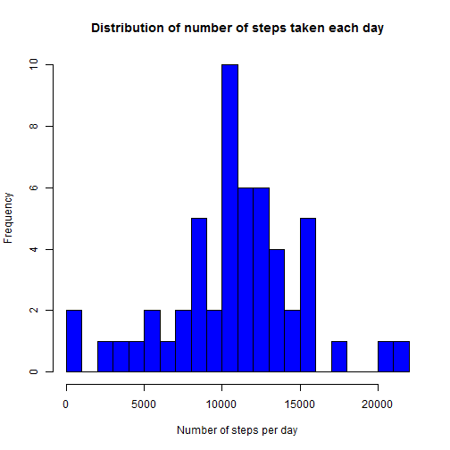
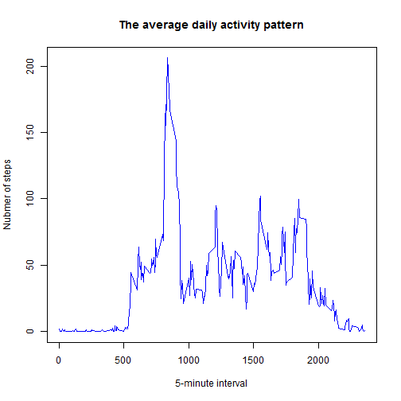
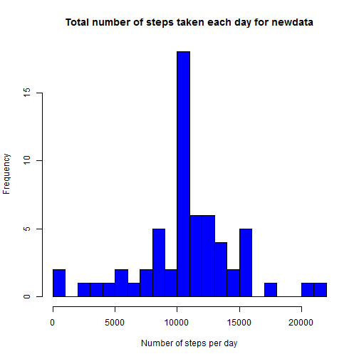
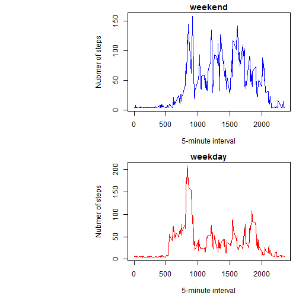

#### title: "PR_assessment1"
#### author: "Ruiqiang Chen"
#### date: "Friday, October 17, 2014"
#### output: html_document

#### This is an R Markdown document for Reproducible Research Peer Assessment #1.

##### 1. Loading and preprocessing the data, the CSV file should be in the directory where this R Markdown file is! The zipped data file could be downloaded from [here] [1]. 
[1]: https://d396qusza40orc.cloudfront.net/repdata%2Fdata%2Factivity.zip "here"


```r
getwd() ### check the active directory for this R markdown to see if the CSV there. 
```

```
## [1] "C:/Users/chenr9/Documents/R assessments"
```

```r
data <- read.csv ("activity.csv", header=TRUE) ## read CSV data
data$date <- as.Date(data$date)
data1 <- na.omit(data) ## remove observations with NA
```

##### 2. What is mean total number of steps taken per day?


```r
c <- tapply(data1$steps, data1$date, sum)
hist(c, breaks=20, col= "blue", xlab= "Number of steps per day", ylab= "Frequency", main = "Distribution of number of steps taken each day")
```

 

```r
DF <- data.frame(c)
names(DF)[1] <- "total_steps"
mean1 <- mean(DF$total_steps)
median1 <- median(DF$total_steps)
cat("mean of total number of steps taken per day is ", mean1)
```

```
## mean of total number of steps taken per day is  10766.19
```

```r
cat("mediam of total number of steps taken per day is ", median1)
```

```
## mediam of total number of steps taken per day is  10765
```


##### 3. What is the average daily activity pattern? 


```r
meanstep_interval <- tapply(data1$steps, data1$interval, mean)
head(meanstep_interval , n=3)
```

```
##         0         5        10 
## 1.7169811 0.3396226 0.1320755
```

```r
str(meanstep_interval )
```

```
##  num [1:288(1d)] 1.717 0.3396 0.1321 0.1509 0.0755 ...
##  - attr(*, "dimnames")=List of 1
##   ..$ : chr [1:288] "0" "5" "10" "15" ...
```

```r
uniq_interval <- unique(data1$interval)
plot(uniq_interval, meanstep_interval , type="l", main= "The average daily activity pattern", xlab= "5-minute interval", ylab= "Nubmer of steps", col="blue")
```

 

```r
stepsframe <- data.frame(meanstep_interval , uniq_interval )
maxstep_interval <- stepsframe[stepsframe$meanstep_interval ==max(meanstep_interval ), ]
maxstep_interval
```

```
##     meanstep_interval uniq_interval
## 835          206.1698           835
```

```r
cat("So the 5-minute interval of", maxstep_interval$uniq_interval, ", on average across all the days in the dataset, contains the maximum number of steps ")
```

```
## So the 5-minute interval of 835 , on average across all the days in the dataset, contains the maximum number of steps
```

##### 4. Inputing missing values, filling in all of the missing values in the dataset to creat a new dataset called 'newdata'.
#####    4.1 Calculate the missing data in the dataset


```r
numbersNA <- (is.na(data$steps)==TRUE)
NumbersOfNa <- length(numbersNA[numbersNA==TRUE])
cat("The total number of rows with NA is", NumbersOfNa)
```

```
## The total number of rows with NA is 2304
```

#####    4.2 filling missing valuess


```r
steps <- c(data$steps)
steps[is.na(steps)]<- mean1/24/12
newdata <- data.frame(steps, data$date, data$interval)
head(newdata, n=3)
```

```
##     steps  data.date data.interval
## 1 37.3826 2012-10-01             0
## 2 37.3826 2012-10-01             5
## 3 37.3826 2012-10-01            10
```
#####    4.3 histogram, mean and mediam for the newdata

```r
c1 <- tapply(newdata$steps, newdata$data.date, sum)
hist(c1, breaks=20, col= "blue", xlab= "Number of steps per day", ylab= "Frequency", main = "Total number of steps taken each day for newdata")
```

 

```r
DF1 <- data.frame(c1)
names(DF1)[1] <- "total_steps2"
mean2 <- mean(DF1$total_steps2)
median2 <- median(DF1$total_steps2)
head(c1)
```

```
## 2012-10-01 2012-10-02 2012-10-03 2012-10-04 2012-10-05 2012-10-06 
##   10766.19     126.00   11352.00   12116.00   13294.00   15420.00
```

```r
cat("mean of total number of steps taken per day of newdata is ", mean2)
```

```
## mean of total number of steps taken per day of newdata is  10766.19
```

```r
cat("mediam of total number of steps taken per day of newdata is ", median2)
```

```
## mediam of total number of steps taken per day of newdata is  10766.19
```
##### These values are almost same from the estimates from the first part of the assignment. The impact of imputing missing data on the estimates of the total daily number of steps is just increasing the frenqucy number of catologe of 10000-11000 steps per day (mean/mediam value).

##### 5. Are there differences in activity patterns between weekdays and weekends?

```r
wd <- weekdays(newdata$data.date)
wd <- as.character(wd)
str(wd)
```

```
##  chr [1:17568] "Monday" "Monday" "Monday" "Monday" "Monday" ...
```

```r
for (i in 1:length(wd)){
      if(wd[i]=="Saturday" | wd[i]=="Sunday") {
            wd[i] <- "weekend"
      } else {
            wd[i] <- "weekday"
      }
}
wd <- as.factor(wd)
str(wd)
```

```
##  Factor w/ 2 levels "weekday","weekend": 1 1 1 1 1 1 1 1 1 1 ...
```

```r
newdata[, "days"] <- wd
str(newdata)
```

```
## 'data.frame':	17568 obs. of  4 variables:
##  $ steps        : num  37.4 37.4 37.4 37.4 37.4 ...
##  $ data.date    : Date, format: "2012-10-01" "2012-10-01" ...
##  $ data.interval: int  0 5 10 15 20 25 30 35 40 45 ...
##  $ days         : Factor w/ 2 levels "weekday","weekend": 1 1 1 1 1 1 1 1 1 1 ...
```

```r
weekend <- newdata[newdata$days=="weekend",]
str(weekend)
```

```
## 'data.frame':	4608 obs. of  4 variables:
##  $ steps        : num  0 0 0 0 0 0 0 0 0 0 ...
##  $ data.date    : Date, format: "2012-10-06" "2012-10-06" ...
##  $ data.interval: int  0 5 10 15 20 25 30 35 40 45 ...
##  $ days         : Factor w/ 2 levels "weekday","weekend": 2 2 2 2 2 2 2 2 2 2 ...
```

```r
c2 <- tapply(weekend$steps, weekend$data.interval, mean)

DF2 <- data.frame(c2)
DF2[, "days"] <- "weekend"
interval <- unique(newdata$data.interval)
DF2[, "interval"] <- interval
head(DF2)
```

```
##          c2    days interval
## 0  4.672825 weekend        0
## 5  4.672825 weekend        5
## 10 4.672825 weekend       10
## 15 4.672825 weekend       15
## 20 4.672825 weekend       20
## 25 7.922825 weekend       25
```

```r
str(DF2)
```

```
## 'data.frame':	288 obs. of  3 variables:
##  $ c2      : num [1:288(1d)] 4.67 4.67 4.67 4.67 4.67 ...
##   ..- attr(*, "dimnames")=List of 1
##   .. ..$ : chr  "0" "5" "10" "15" ...
##  $ days    : chr  "weekend" "weekend" "weekend" "weekend" ...
##  $ interval: int  0 5 10 15 20 25 30 35 40 45 ...
```

```r
weekday <- newdata[newdata$days=="weekday",]
str(weekday)
```

```
## 'data.frame':	12960 obs. of  4 variables:
##  $ steps        : num  37.4 37.4 37.4 37.4 37.4 ...
##  $ data.date    : Date, format: "2012-10-01" "2012-10-01" ...
##  $ data.interval: int  0 5 10 15 20 25 30 35 40 45 ...
##  $ days         : Factor w/ 2 levels "weekday","weekend": 1 1 1 1 1 1 1 1 1 1 ...
```

```r
c3 <- tapply(weekday$steps, weekday$data.interval, mean)

DF3 <- data.frame(c3)
DF3[, "days"] <- "weekday"
DF3[, "interval"] <- interval
head(DF3)
```

```
##          c3    days interval
## 0  7.006569 weekday        0
## 5  5.384347 weekday        5
## 10 5.139902 weekday       10
## 15 5.162124 weekday       15
## 20 5.073235 weekday       20
## 25 6.295458 weekday       25
```

```r
str(DF3)
```

```
## 'data.frame':	288 obs. of  3 variables:
##  $ c3      : num [1:288(1d)] 7.01 5.38 5.14 5.16 5.07 ...
##   ..- attr(*, "dimnames")=List of 1
##   .. ..$ : chr  "0" "5" "10" "15" ...
##  $ days    : chr  "weekday" "weekday" "weekday" "weekday" ...
##  $ interval: int  0 5 10 15 20 25 30 35 40 45 ...
```

```r
par(mfrow =c(2,1))
par(mar = c(4.5, 15, 1.5, 1.0))
plot(DF2$interval, DF2$c2, type="l", main = "weekend", xlab="5-minute interval", ylab="Nubmer of steps", col="blue")
plot(DF3$interval, DF3$c3, type="l", main= "weekday", xlab= "5-minute interval", ylab= "Nubmer of steps", col="red")
```

 

```r
cat("Conclusion: there are differences in activity patterns between weekdays and weekends, that is most of 5-minute intervals in weekdend have average steps over 50, but most of 5-minute intervals in weekdays less than 50. ")
```

```
## Conclusion: there are differences in activity patterns between weekdays and weekends, that is most of 5-minute intervals in weekdend have average steps over 50, but most of 5-minute intervals in weekdays less than 50.
```

